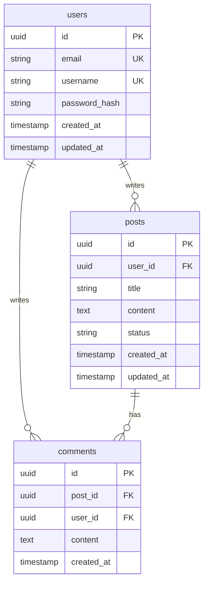

# Database Schema Documentation

## 🗄 Database Overview

### Database Type
- **System**: [PostgreSQL/MySQL/MongoDB]
- **Version**: [Version Number]
- **Hosting**: [AWS RDS/Supabase/Self-hosted]
- **Connection Pooling**: [Yes/No - Details]

### Naming Conventions
- **Tables**: `snake_case` plural (e.g., `user_profiles`)
- **Columns**: `snake_case` (e.g., `created_at`)
- **Indexes**: `idx_table_column` (e.g., `idx_users_email`)
- **Foreign Keys**: `fk_table_reference` (e.g., `fk_posts_user_id`)

## 📊 Schema Diagram



## 🏗 Table Definitions

### users
```sql
CREATE TABLE users (
    id UUID PRIMARY KEY DEFAULT gen_random_uuid(),
    email VARCHAR(255) UNIQUE NOT NULL,
    username VARCHAR(50) UNIQUE NOT NULL,
    password_hash VARCHAR(255) NOT NULL,
    role VARCHAR(20) DEFAULT 'user',
    is_active BOOLEAN DEFAULT true,
    created_at TIMESTAMP DEFAULT CURRENT_TIMESTAMP,
    updated_at TIMESTAMP DEFAULT CURRENT_TIMESTAMP
);

-- Indexes
CREATE INDEX idx_users_email ON users(email);
CREATE INDEX idx_users_username ON users(username);
CREATE INDEX idx_users_created_at ON users(created_at DESC);
```

### [table_name]
```sql
CREATE TABLE [table_name] (
    -- Column definitions
);

-- Indexes
-- Foreign Keys
-- Constraints
```

## 🔗 Relationships

### One-to-Many
- `users` → `posts` (One user has many posts)
- `posts` → `comments` (One post has many comments)

### Many-to-Many
```sql
-- Example: users_roles junction table
CREATE TABLE users_roles (
    user_id UUID REFERENCES users(id) ON DELETE CASCADE,
    role_id UUID REFERENCES roles(id) ON DELETE CASCADE,
    assigned_at TIMESTAMP DEFAULT CURRENT_TIMESTAMP,
    PRIMARY KEY (user_id, role_id)
);
```

### One-to-One
```sql
-- Example: user_profiles
CREATE TABLE user_profiles (
    user_id UUID PRIMARY KEY REFERENCES users(id) ON DELETE CASCADE,
    bio TEXT,
    avatar_url VARCHAR(500),
    -- other profile fields
);
```

## 🔐 Security Considerations

### Sensitive Data
- **Encryption**: [Which fields are encrypted]
- **PII Fields**: [List of personally identifiable information]
- **Audit Trail**: [How changes are tracked]

### Access Control
```sql
-- Row Level Security Example (PostgreSQL)
ALTER TABLE posts ENABLE ROW LEVEL SECURITY;

CREATE POLICY posts_access_policy ON posts
    FOR ALL
    USING (user_id = current_user_id() OR is_public = true);
```

## 📈 Performance Optimization

### Indexes Strategy
```sql
-- Composite indexes for common queries
CREATE INDEX idx_posts_user_status_created 
    ON posts(user_id, status, created_at DESC);

-- Partial indexes for filtered queries
CREATE INDEX idx_posts_published 
    ON posts(created_at DESC) 
    WHERE status = 'published';
```

### Partitioning Strategy
```sql
-- Example: Partition by date
CREATE TABLE posts_2024 PARTITION OF posts
    FOR VALUES FROM ('2024-01-01') TO ('2025-01-01');
```

## 🔄 Migration Strategy

### Migration Tools
- **Tool**: [Prisma/TypeORM/Knex/Flyway]
- **Location**: `/migrations`
- **Naming**: `YYYYMMDDHHMMSS_description.sql`

### Migration Example
```sql
-- Migration: 20240101120000_add_user_preferences.sql
BEGIN;

CREATE TABLE user_preferences (
    user_id UUID PRIMARY KEY REFERENCES users(id) ON DELETE CASCADE,
    theme VARCHAR(20) DEFAULT 'light',
    language VARCHAR(10) DEFAULT 'en',
    notifications_enabled BOOLEAN DEFAULT true,
    created_at TIMESTAMP DEFAULT CURRENT_TIMESTAMP,
    updated_at TIMESTAMP DEFAULT CURRENT_TIMESTAMP
);

CREATE TRIGGER update_user_preferences_updated_at
    BEFORE UPDATE ON user_preferences
    FOR EACH ROW
    EXECUTE FUNCTION update_updated_at_column();

COMMIT;
```

## 🎯 Triggers & Functions

### Common Triggers
```sql
-- Update timestamp trigger
CREATE OR REPLACE FUNCTION update_updated_at_column()
RETURNS TRIGGER AS $$
BEGIN
    NEW.updated_at = CURRENT_TIMESTAMP;
    RETURN NEW;
END;
$$ language 'plpgsql';

CREATE TRIGGER update_users_updated_at
    BEFORE UPDATE ON users
    FOR EACH ROW
    EXECUTE FUNCTION update_updated_at_column();
```

### Stored Procedures
```sql
-- Example: Get user statistics
CREATE OR REPLACE FUNCTION get_user_stats(user_id UUID)
RETURNS TABLE (
    post_count BIGINT,
    comment_count BIGINT,
    last_activity TIMESTAMP
) AS $$
BEGIN
    RETURN QUERY
    SELECT 
        COUNT(DISTINCT p.id),
        COUNT(DISTINCT c.id),
        MAX(GREATEST(p.created_at, c.created_at))
    FROM users u
    LEFT JOIN posts p ON u.id = p.user_id
    LEFT JOIN comments c ON u.id = c.user_id
    WHERE u.id = user_id
    GROUP BY u.id;
END;
$$ LANGUAGE plpgsql;
```

## 📊 Views

### Materialized Views
```sql
CREATE MATERIALIZED VIEW user_activity_summary AS
SELECT 
    u.id,
    u.username,
    COUNT(DISTINCT p.id) as post_count,
    COUNT(DISTINCT c.id) as comment_count,
    MAX(p.created_at) as last_post_date,
    MAX(c.created_at) as last_comment_date
FROM users u
LEFT JOIN posts p ON u.id = p.user_id
LEFT JOIN comments c ON u.id = c.user_id
GROUP BY u.id, u.username;

-- Refresh strategy
CREATE INDEX idx_user_activity_summary_user_id ON user_activity_summary(id);
```

## 🔍 Common Queries

### User Dashboard Query
```sql
-- Get user with recent activity
SELECT 
    u.*,
    COUNT(DISTINCT p.id) as post_count,
    COUNT(DISTINCT c.id) as comment_count,
    ARRAY_AGG(DISTINCT p.title ORDER BY p.created_at DESC LIMIT 5) as recent_posts
FROM users u
LEFT JOIN posts p ON u.id = p.user_id AND p.created_at > NOW() - INTERVAL '30 days'
LEFT JOIN comments c ON u.id = c.user_id AND c.created_at > NOW() - INTERVAL '30 days'
WHERE u.id = $1
GROUP BY u.id;
```

## 🚨 Constraints & Validations

### Check Constraints
```sql
ALTER TABLE users 
    ADD CONSTRAINT check_email_format 
    CHECK (email ~* '^[A-Za-z0-9._%+-]+@[A-Za-z0-9.-]+\.[A-Z|a-z]{2,}$');

ALTER TABLE posts 
    ADD CONSTRAINT check_status_values 
    CHECK (status IN ('draft', 'published', 'archived'));
```

### Unique Constraints
```sql
-- Composite unique constraint
ALTER TABLE user_settings 
    ADD CONSTRAINT unique_user_setting 
    UNIQUE (user_id, setting_key);
```

## 🔧 Maintenance

### Backup Strategy
- **Frequency**: [Daily/Hourly]
- **Retention**: [30 days]
- **Method**: [pg_dump/AWS RDS snapshots]

### Monitoring Queries
```sql
-- Table sizes
SELECT 
    schemaname,
    tablename,
    pg_size_pretty(pg_total_relation_size(schemaname||'.'||tablename)) AS size
FROM pg_tables
WHERE schemaname = 'public'
ORDER BY pg_total_relation_size(schemaname||'.'||tablename) DESC;

-- Slow queries
SELECT 
    query,
    calls,
    total_time,
    mean_time,
    max_time
FROM pg_stat_statements
ORDER BY mean_time DESC
LIMIT 10;
```

## 📝 Data Types Reference

### Common Patterns
- **IDs**: UUID with `gen_random_uuid()`
- **Timestamps**: TIMESTAMP without timezone
- **Money**: DECIMAL(10,2)
- **JSON**: JSONB for flexibility
- **Enums**: VARCHAR with CHECK constraints

### Type Mappings
| Application Type | Database Type | Example |
|-----------------|---------------|---------|
| ID | UUID | `id UUID PRIMARY KEY` |
| Email | VARCHAR(255) | `email VARCHAR(255)` |
| Password | VARCHAR(255) | `password_hash VARCHAR(255)` |
| Text | TEXT | `description TEXT` |
| Boolean | BOOLEAN | `is_active BOOLEAN` |
| Timestamp | TIMESTAMP | `created_at TIMESTAMP` |